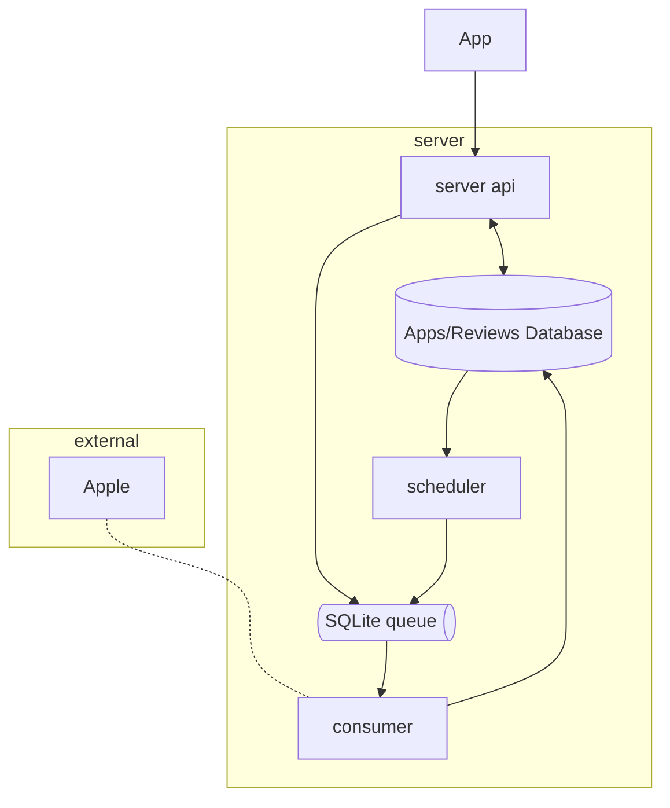

# Apps Reviews

A microservices-based system that continuously monitors the Apple App Store for new reviews of configured apps and provides a web interface to search and view them.

## Architecture Overview

The system follows a **microservices architecture** with three main services that communicate through a persistent queue:



### Services

- **Server** (`cmd/server`): HTTP API server providing REST endpoints for the web app
- **Scheduler** (`cmd/scheduler`): Periodically schedules app review fetching by adding app IDs to the queue
- **Consumer** (`cmd/consumer`): Processes queued app IDs and fetches new reviews from Apple's API

More detailed information can be found in [web/README.md](web/README.md) and [server/README.md](server/README.md)

## Quick Start

### Prerequisites

- Go 1.24.2+
- Node.js 18+
- npm
- [goose](https://github.com/pressly/goose) (for database migrations)

### Installation

```bash
# Install dependencies and run database migrations
make init
```

### Running

```bash
# Start all services and web interface
make dev

# Or start them separately in different terminals:
make dev-server     # HTTP API server on :8080
make dev-scheduler  # Scheduler service
make dev-consumer   # Consumer service
make dev-web        # React dev server on :5173
```

**Note**: All three backend services (server, scheduler, consumer) need to be running for the system to work properly.

### Example Usage

```bash
# Set polling interval to 1 minute (optional)
export POLLING_INTERVAL="1m"

# Start all services
make dev
```

Then visit `http://localhost:5173` to:

1. Add new apps by App ID using the web interface
2. Search and view reviews for monitored apps

## API Reference

### GET /api/reviews/{appID}

Fetch reviews for a specific Apple App Store app ID.

### GET /api/apps

Fetch all monitored apps.

**Response:**

```json
{
  "data": [
    {
      "id": "1458862350",
      "name": "Hevy - Workout Tracker Gym Log",
      "thumbnail_url": "https://...",
      "created_at": "2024-01-01T12:00:00Z",
      "updated_at": "2024-01-01T12:00:00Z"
    }
  ]
}
```

### GET /api/apps/{appID}

Fetch a monitored apps.

**Response:**

```json
{
  "data": {
    "id": "1458862350",
    "name": "Hevy - Workout Tracker Gym Log",
    "thumbnail_url": "https://...",
    "created_at": "2024-01-01T12:00:00Z",
    "updated_at": "2024-01-01T12:00:00Z"
  }
}
```

### POST /api/apps/{appID}

Add a new app to monitor by Apple App Store ID.

**Response:**

```json
"1458862350"
```

### Reviews Response Format

```json
{
  "data": [
    {
      "id": "review-id",
      "author": {
        "name": "User Name",
        "uri": "user-profile-uri"
      },
      "title": "Review Title",
      "content": "Review content...",
      "rating": 5,
      "updated": "2024-01-01T12:00:00Z"
    }
  ]
}
```

**Status Codes:**

- `200` - Success
- `201` - Created (for POST requests)
- `400` - Bad request (invalid app ID)
- `404` - App not found or no reviews available
- `500` - Internal server error

## System Requirements

### Database Migrations

The system uses `goose` for database migrations. Migrations are automatically run during `make init`.

Manual migration commands:

```bash
make migrate-up    # Run pending migrations
make migrate-down  # Rollback last migration
```

### Data Storage

- **SQLite Database**: `server/data/database.db` - Apps and reviews storage
- **Queue Database**: `server/data/queue.db` - Job queue for async processing

## TODO

### Missing Features & Improvements

- [ ] **Testing**
- [ ] **API Improvements**:
  - [ ] Pagination support for reviews endpoint
  - [ ] App deletion endpoint
