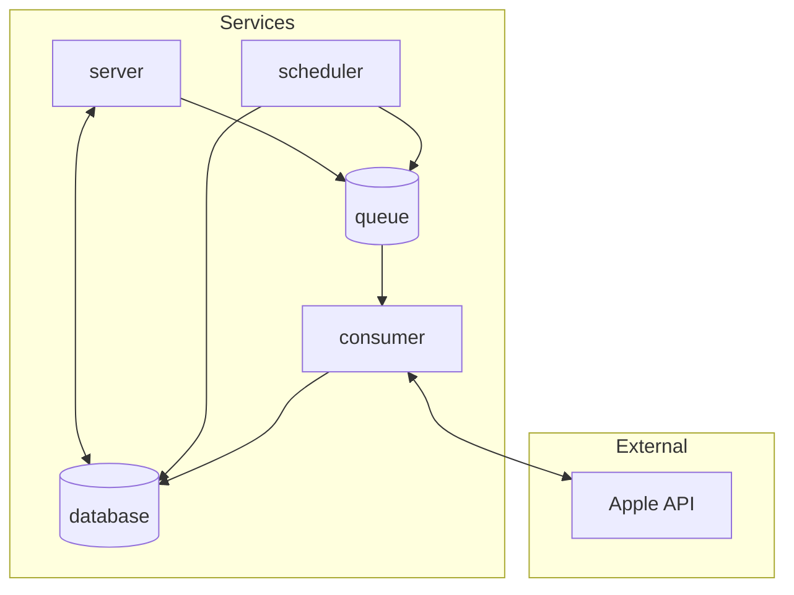

# Apps Reviews Server

A microservices-based backend system built with Go that provides REST APIs for monitoring Apple App Store reviews.

## Architecture

The backend follows a **microservices architecture** with three separate services that work together:

### Services Overview



### 1. Server Service (`cmd/server/`)

**HTTP API Layer**

- RESTful API server with route handling
- CORS middleware for cross-origin requests
- Request/response transformation and error handling

**Endpoints:**

- `GET /reviews/{appID}` - Fetch reviews for a specific app
- `GET /apps` - List all apps
- `POST /apps/{appID}` - Add a new app to monitor

### 2. Scheduler Service (`cmd/scheduler/`)

**Job Scheduling Layer**

- Periodically queries the apps database for apps
- Adds app IDs to the processing queue at configurable intervals

### 3. Consumer Service (`cmd/consumer/`)

**Background Processing Layer**

- Processes app IDs from the queue
- Fetches new reviews from Apple's RSS feeds
- Stores new reviews in the database
- Handles incremental fetching to avoid duplicates

### Shared Components

**Data Layer (`internal/models/`, `internal/db/`)**

- Domain models with transformation logic between Apple API and internal formats
- SQLite database with proper migrations
- Structured storage for apps and reviews

**Queue System (`internal/queue/`)**

- Persistent SQLite-based queue using `gopq`
- Enables asynchronous communication between services
- Ensures reliable job processing

**External Integration (`pkg/apple/`)**

- Apple App Store RSS feed and search API clients
- Data structures and parsing logic for Apple's formats

## Running the Services

### All Services (Recommended)

Use the Makefile to start all services:

```bash
# From the project root
make dev
```

This starts all three services plus the web interface.

### Individual Services

Run each service separately for development:

```bash
# Server (HTTP API)
go run ./cmd/server

# Scheduler (Job scheduling)
go run ./cmd/scheduler

# Consumer (Background processing)
go run ./cmd/consumer
```

**Important**: All three services need to be running for the system to function properly:

- **Server**: Handles web requests and provides APIs
- **Scheduler**: Adds app IDs to the queue for processing
- **Consumer**: Fetches new reviews from Apple

### Database Setup

Before running services, ensure the database is migrated:

```bash
make migrate-up
```

## API Endpoints

### Reviews

#### Get Reviews for App

```
GET /reviews/{appID}
```

Returns recent reviews for the specified Apple App ID.

**Response:**

```json
{
  "data": [
    {
      "id": "review-id",
      "author": {
        "name": "Author Name",
        "uri": "author-uri"
      },
      "title": "Review Title",
      "content": "Review content...",
      "rating": 5,
      "updated": "2024-01-01T12:00:00Z"
    }
  ]
}
```

### Apps Management

#### Get All Apps

```
GET /apps
```

Returns all currently monitored apps.

**Response:**

```json
{
  "data": [
    {
      "id": "1458862350",
      "name": "Hevy - Workout Tracker Gym Log",
      "thumbnail_url": "https://...",
      "created_at": "2024-01-01T12:00:00Z",
      "updated_at": "2024-01-01T12:00:00Z"
    }
  ]
}
```

#### Get App Details

```
GET /apps/{appID}
```

Returns details for a specific app by its Apple App ID.

**Response:**

```json
{
  "data": {
    "id": "1458862350",
    "name": "Hevy - Workout Tracker Gym Log",
    "thumbnail_url": "https://...",
    "created_at": "2024-01-01T12:00:00Z",
    "updated_at": "2024-01-01T12:00:00Z"
  }
}
```

#### Add New App

```
POST /apps/{appID}
```

Adds a new app to the monitoring system. The app data is automatically fetched from Apple's API.

**Response:**

```json
"1458862350"
```

**Status Codes:**

- `201` - App successfully added
- `400` - Invalid app ID format
- `500` - Error fetching app data or saving to database

## Configuration

All services can be configured using environment variables:

### Environment Variables

| Variable             | Description                              | Default | Example                  | Used By      |
| -------------------- | ---------------------------------------- | ------- | ------------------------ | ------------ |
| `PORT`               | HTTP server port                         | `8080`  | `PORT=3000`              | Server       |
| `LOG_LEVEL`          | Logging level for all services           | `debug` | `LOG_LEVEL=info`         | All services |
| `REVIEWS_TIME_LIMIT` | How far back to fetch reviews from Apple | `48h`   | `REVIEWS_TIME_LIMIT=72h` | Consumer     |
| `POLLING_INTERVAL`   | How often scheduler adds apps to queue   | `30s`   | `POLLING_INTERVAL=5m`    | Scheduler    |

### Database Configuration

- **Database File**: `data/database.db` (SQLite)
- **Queue File**: `data/queue.db` (SQLite)
- **Migrations**: `migrations/` directory

#### Log Levels

Available log levels:

| Level   | Description                  | Use Case                                   |
| ------- | ---------------------------- | ------------------------------------------ |
| `debug` | Detailed debug information   | Development and troubleshooting            |
| `info`  | General information messages | Normal operation monitoring                |
| `warn`  | Warning messages             | Potential issues that don't stop operation |
| `error` | Error messages               | Errors that affect functionality           |

## Database Migrations

Use [goose](https://github.com/pressly/goose) for schema changes:

```bash
# Create new migration
goose -dir migrations create migration_name sql

# Run migrations
make migrate-up

# Rollback
make migrate-down
```
